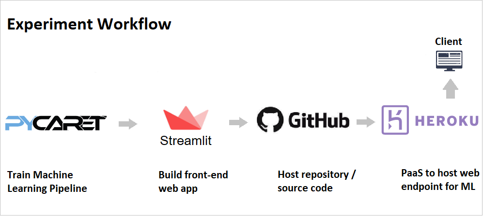

# Build and deployed  machine learning web app to predict insurance bill.

## Description:
In this project we will train a machine learning pipeline using PyCaret and create a web app using a Streamlit open-source framework. This web app will be a simple interface for business users to generate bill predictions from patients demographich dataset using a trained machine learning pipeline. 

### Patients Bill Prediction

An insurance company wants to improve its cash flow forecasting by better predicting patient charges using demographic and basic patient health risk metrics at the time of hospitalization. So developed Machine learning Regression algorithm for predicting Patients bill using demographic datas of patients. Utilized Pycaret(https://www.pycaret.org) for developing the model and pipeline. Optimized regression model and finalized Gradient Boosting Regression Algorithm for prediction with minimum error. The link to jupyter notebook is  https://github.com/vidhya-5684/Insurance-Bill-prediction-App/blob/main/charge_prediction.ipynb

### App Developement
Now that our machine learning pipeline and model are ready we will start building a front-end web application that can generate predictions on new datapoints. This application will support ‘Online’ as well as ‘Batch’ predictions through a csv file upload. Utilized Streamlite, a opensource service for the deployement of the web app.  

### Deployed App on Heroku

Now that the model is trained, the machine learning pipeline is ready, and the application is tested on our local machine, deployed the app to Heroku. To upload the application source code onto Heroku we linked  a GitHub repository to the Heroku account.Using Heroku the app is published on https://charge-reduction.herokuapp.com.

## Tools Used

* Pycaret
* Classification ML Algorithms(AdaBoost, Gradient Boosting and RandomForest)
* Streamlite
* Git 
* Heroku

## Potential Impact
Predicting the hospital charges of patients would help Insurance Companies to forecast the cashflow. The app I devloped helps the companies to predict the charges as indvidual and as batches, so it will positively impacts the company's turnover.

